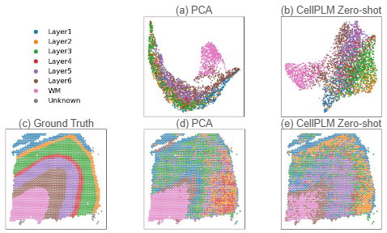

# Benchmarking a Spatial-Aware Foundation Model: An Empirical Evaluation of CellPLM in Transcriptomics

**Accepted at CIBB 2026**

This repository contains the code and resources for our CIBB 2026 paper, which provides an independent empirical evaluation of the CellPLM foundation model. This work is an extension of a Master of Science Dissertation completed at the University of Manchester.

**Authors:** Juha Im*, Haiping Liu*, and Hongpeng Zhou
(* Equal contribution. Affiliation: University of Manchester, UK)

---

## ⚠️ Acknowledgement & Original Repository

**This codebase is heavily based on the original CellPLM repository.** 
We explicitly acknowledge the original authors for their foundational work on the CellPLM architecture. If you are looking for the original CellPLM framework, pre-training details, or original weights, please visit their official repository:

* **Original Paper:** [CellPLM: Pre-training of Cell Language Model Beyond Single Cells](https://openreview.net/forum?id=BKXvPDekud)
* **Original GitHub:** [CellPLM Official Repository](https://github.com/TencentAILabHealthcare/CellPLM)

Please cite the original paper if you utilize the core model architecture:
```bibtex
@article{wen2023cellplm,
  title={CellPLM: Pre-training of Cell Language Model Beyond Single Cells},
  author={Wen, Hongzhi and Tang, Wenzhuo and Dai, Xinnan and Ding, Jiayuan and Jin, Wei and Xie, Yuying and Tang, Jiliang},
  journal={bioRxiv},
  pages={2023--10},
  year={2023},
  publisher={Cold Spring Harbor Laboratory}
}
```
## 🌟 Overview

This repository contains the code and resources related to the Short paper, **"Benchmarking a Spatial-Aware Foundation Model: An Empirical Evaluation of CellPLM in Transcriptomics."** The work focuses on extensively **evaluating** the **CellPLM** (Cell Pre-trained Language Model) foundation model, a Transformer-based architecture designed for single-cell and spatial transcriptomics (ST) data analysis.

## ✨ Key Project Achievements

The project makes several crucial contributions, particularly in the area of fine-tuning CellPLM for optimal performance and efficiency.

  * **Extended Empirical Evaluation:** Conducted extensive experiments on a wide array of scRNA-seq and ST datasets (e.g., Breast Cancer, Aorta, DLPFC Visium, MERFISH mouse brain2) that were not fully covered in the original CellPLM work.
 
## 📊 Evaluation Results Summary

| Task | Datasets | Key Finding |
| :--- | :--- | :--- |
| **Cell Embedding Clustering** | DLPFC, Mouse Hippocampus, Breast Cancer, Colorectal Cancer, Lung | **CellPLM (Zero-shot)** consistently **outperforms PCA** on all datasets. |
| **Cell Type Annotation** | DLPFC, Mouse Hippocampus, Breast Cancer, Colorectal Cancer, Lung | **Fine-tuning is essential**; zero-shot accuracy is near random. CellPLM demonstrates **strong generalization** on unseen scRNA-seq data (Lung, Colorectal cancer) with F1-scores above 0.95. |
| **ST Imputation** | DLPFC Visium, MERFISH Mouse Hippocampus | The utility of scRNA-seq reference data is **context-dependent**. It is beneficial for extremely sparse datasets like MERFISH (155 genes) but provides limited advantage for richer datasets like DLPFC Visium (33,538 genes). |

<p align="center">
  
</p>

## Quick start

**Install dependencies**

```bash
# Recommended: Python 3.9, CUDA >= 11.7
pip install -r requirements.txt
```

**Or using conda (recommended for reproducibility):**

```bash
conda create -n cellplm python=3.9 -y
conda activate cellplm
conda install cudatoolkit=11.7 -c pytorch -c nvidia
pip install -r requirements.txt
```

### Data Preparation

The datasets used in this work are publicly available and listed in the paper:

  * **scRNA-seq:** Breast Cancer, Colorectal Cancer, Lung.
  * **ST:** DLPFC Visium (12 samples), MERFISH Mouse Brain2 (5 samples).

The preprocessing functions from the CellPLM framework (`common_preprocess` and `transcriptomics_dataset`) were used to standardize `AnnData` objects and filter the gene list against the pre-trained set.

## Pretrained CellPLM Model Checkpoints
The checkpoint can be acquired from [dropbox](https://www.dropbox.com/scl/fo/i5rmxgtqzg7iykt2e9uqm/h?rlkey=o8hi0xads9ol07o48jdityzv1&dl=0). 
[10/10/2023] The latest version is `20230926_85M`.

## 🚀 Running Experiments

Detailed scripts and configuration files for reproducing the main fine-tuning results (SupConLoss vs. Cross-Entropy) are located in the `tutorials/` directory.

### 1\. Cell Embedding Clustering 

To reproduce the key comparison of fine-tuning efficiency and performance on a dataset like Aorta:

  * **Configuration:** Adjust hyperparameters in the relevant pipeline file, `CellPLM/CellPLM/pipeline/cell_embedding.py`.
  * **Execution:**
    ```bash
    # Run with Supervised Contrastive Loss
    python embedding.py
    ```
  * **Metrics:** Clustering metrics (ARI, NMI) will be reported as shown in Table 2 of the paper.

### 2\. Cell Type Annotation

  * **Configuration:** The best performing setting used an **Autoencoder** as the latent model, with 3,000 highly variable genes (HVGs) and no positional encoding (PE). Adjust hyper parameters in `CellPLM/CellPLM/pipeline/cell_type_annotation.py`
  * **Execution (Example: DLPFC Layer Segmentation):**
    ```bash
    python annotation_fit.py 
    ```
  * **Metrics:** Accuracy and Macro $F_{1}$ scores will be reported.

### 3\. Spatial Transcriptomics Imputation

  * **Configuration:** Adjust hyper parameters in `CellPLM/CellPLM/pipeline/imputation.py`
  * **Execution (Example: DLPFC):**
    ```bash
    # Fine-tuning with scRNA-seq reference data
    python imputation_fit.py 

    # Zero-shot inference (Pre-trained parameters only)
    python imputation_zeroshot.py 
    ```
  * **Metrics:** Results include MSE, RMSE, MAE, Pearson's Correlation Coefficient (PCC), and Cosine similarity.

## Repository layout (important files)

- `CellPLM/` — core Python package (models, layers, utils)
- `ckpt/` — model checkpoints (`.ckpt`) and corresponding `.config.json` files
- `data/` — datasets (raw / preprocessed samples)
- `image/` — figures used in the paper and experiment visualizations
- `tutorials/` — example notebooks and finetuning
- `requirements.txt` — full dependency list
- `juhaim_thesis_end.pdf` — thesis PDF included in repository


